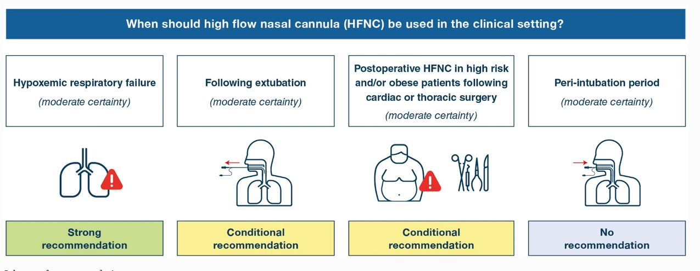

---
# HFNC nell'insufficienza respiratoria acuta

Considerazioni sulle possibili indicazioni all'utilizzo di HFNC
nell'insufficienza respiratoria acuta dell'adulto, tratte da recenti
linee guida di pratica clinica della European Society of Intensive Care
Medicine (ESICM) e della European Respiratory Society (ERS).

 Dr. O. Sagliocco 

---

## The role for high flow nasal cannula as a respiratory support strategy in adults: a clinical practice guideline.

---

 <b>Intensive Care Med</b> 46, 2226--2237 (<b>2020</b>) 

---

Il panel di clinici e metodologi dell'ESICM fornisce quattro raccomandazioni -- di cui una gradata *"strong recommendation"*[^1] -- per guidare l'uso dell'HFNC nella
pratica clinica: 

-   una raccomandazione **forte**a favore di l'**HFNC** nell'**insufficienza
    respiratoria ipossiemica** (certezza moderata);

-   una raccomandazione <u>condizionale</u> per l'**HFNC dopo  l'estubazione** (certezza moderata);

-   nessuna raccomandazione riguardante l'HFNC nel periodo peri-intubazione (certezza moderata):

-   una raccomandazione <u>condizionale</u> per l'**HFNC nel**  **postoperatorio in pazienti ad alto rischio e/o obesi dopo chirurgia cardiaca o toracica** (certezza moderata).

Le raccomandazioni sono state proposte in seguito ad una revisione sistematica della letteratura, alla valutazione del rischio di bias dei singoli studi randomizzati e alla valutazione della certezza dell\'evidenza per ciascun risultato con l'utilizzo della metodologia GRADE[^2], in un contesto di discreta incertezza.

---

## ERS clinical practice guidelines: high-flow nasal cannula in acute  respiratory failure.

 <b>Eur Respir J 2022</b>

---

### Background

La cannula nasale ad alto flusso (HFNC) è diventata una forma non
invasiva di supporto respiratorio frequentemente utilizzata in contesti
acuti; tuttavia, le **prove** a sostegno del suo utilizzo sono emerse solo
di recente.

Vengono fornite raccomandazioni basate sull'evidenza per
l'uso dell'HFNC insieme ad altre forme non invasive di supporto
respiratorio (*NIV --* ventilazione non invasiva, *COT* --
ossigenoterapia convenzionale) negli adulti con insufficienza
respiratoria acuta (*ARF* -- acute respiratory failure). Purtroppo, a
causa di limiti nella certezza delle prove e della differenza nelle
risorse disponibili, tutte le raccomandazioni sono deboli
("*weak/conditional"*). La task force ha sviluppato otto
*raccomandazioni condizionali[^3],* in
cuiil panel conclude che gli effetti desiderabili dell\'adesione a una
raccomandazione
**probabilmente** superano gli effetti indesiderati, ma
non piò esserne
sicuro.

### Raccomandazioni

Viene <u>suggerito</u>l'uso di:

1\) **HFNC** rispetto a COT nell\'**ARF ipossiemica**;

2\) **HFNC** rispetto a NIV nell\'**ARF ipossiemica**;

3\) **HFNC** rispetto a COT durante le **pause dalla NIV**;

4\) HFNC o COT in pazienti postoperatori a basso rischio di complicanze polmonari;

5\) HFNC o NIV in pazienti postoperatori ad alto rischio di complicanze
polmonari;

6\) **HFNC** rispetto a COT in pazienti non chirurgici a **basso rischio
di fallimento dell\'estubazione**;

7\) **NIV** su HFNC per pazienti ad [[**alto rischio di fallimento
dell\'estubazione**
a meno che non vi siano controindicazioni relative o assolute alla NIV;

8\) sperimentare la **NIV** prima dell\'uso dell\'HFNC in pazienti con
**BPCO e ARF ipercapnica**.

Le uniche raccomandazioni gradate "*moderate certainty of evidence"*
sono la 1 e la 7, le altre sono gradate "*low"* o "*very low"* (sistema
GRADE), quindi per nessuna il panel utilizza il termine "raccomanda" ma
solo il termine "suggerisce".

### Dettagli

#### HFNC nell'insufficienza respiratoria acuta ipossiemica

##### 1 - Suggeriamo l\'uso di HFNC rispetto a COT negli adulti con insufficienza respiratoria acuta ipossiemica (evidenza moderata).

In questa domanda è stata affrontata l'AHRF de novo, piuttosto che
l'ARDS già diagnosticata, poiché non vi è ancora consenso sulla
possibilità o meno di diagnosticare l'ARDS ai pazienti non intubati.

I potenziali meccanismi di fallimento della COT includono un supporto
inefficace a soddisfare le esigenze ventilatorie del paziente,
erogazione inaffidabile di FiO2, mancanza di umidificazione e lesioni
polmonari autoinflitte dal paziente (P-SILI).

HFNC è un\'interfaccia non invasiva per l\'erogazione di ossigeno ad
alta concentrazione che risolve alcune delle limitazioni della COT.
Fornendo flussi d\'aria fino a 50-60 L·min−1, HFNC si adatta
perfettamente alle esigenze inspiratorie dei pazienti dispnoici con AHRF
e raggiunge in modo affidabile una FiO2 fino al 100%, fornendo allo
stesso tempo un basso livello di pressione positiva di fine espirazione
(PEEP) nelle vie aeree superiori, facilitando il reclutamento alveolare.
Altri potenziali benefici dell'HFNC rispetto alla COT includono la
riduzione del rischio di P-SILI, l'evitamento di variazioni dannosi
nella pressione transpolmonare, il washout dell'anidride carbonica dalle
vie aeree superiori, una migliore ventilazione e la fornitura di
un'umidificazione affidabile, con aumento del comfort del paziente e
migliore eliminazione delle secrezioni. Questi benefici clinici e
fisiologici costituiscono una forte motivazione per l'**uso precoce
dell'HFNC** per prevenire la necessità di ventilazione a pressione
positiva non invasiva e invasiva e per ridurre il rischio di mortalità
per lo più correlato alle complicanze associate al ventilatore. Ciò è
particolarmente vero per i **pazienti immunocompromessi** che hanno
maggiori probabilità di sviluppare complicanze correlate all'IMV
(ventilazione meccanica invasiva), come la polmonite associata al
ventilatore (VAP).

L\'HFNC può **ridurre l'escalation ad intubazione e NIV**, riduce il
fastidio della dispnea del paziente e abbassa leggermente la frequenza
respiratoria. L'impatto dell'HFNC sullo scambio di gas è generalmente
piccolo, con HFNC che aumenta la pressione parziale dell\'ossigeno nel
sangue arterioso senza un effetto sostanziale sulla tensione
dell\'anidride carbonica arteriosa.

L'impatto sulla durata della degenza non è coerente, suggerendo un
aumento della degenza in terapia intensiva di 1,97 giorni, con una
piccola riduzione complessiva della durata dell'ospedalizzazione di 0,72
giorni.

Il bilancio degli effetti, in particolare una riduzione della frequenza
di intubazione, probabilmente favorisce l\'HFNC rispetto alla COT.

Esistono pochi dati di alta qualità per guidare l'efficacia dell'HFNC
nel COVID-19.

Il panel non fornisce raccomandazioni riguardo all'uso della posizione
prona da sveglio nell'HFNC, riconoscendo che ci sono poche prove e pochi
studi randomizzati per affrontare la questione.

##### 2 - Suggeriamo l\'uso della HFNC rispetto alla NIV nei pazienti con
insufficienza respiratoria acuta ipossiemica (evidenza molto bassa).

HFNC e NIV sono utilizzati più frequentemente nei pazienti con AHRF
progressiva o da moderata a grave (PaO2/FiO2 ⩽200 mmHg), quando i rischi
di intubazione e morte sono più elevati. Nell\'AHRF più grave (PaO2/FiO2
\<100 mmHg), i medici mirano a bilanciare i benefici derivanti dal
mantenimento della respirazione spontanea e dall\'evitare l\'intubazione
insieme alle sue complicanze (ad esempio VAP e danno polmonare indotto
dal ventilatore) rispetto ai danni dell\'intubazione ritardata, inclusi
elevato sforzo  inspiratorio, aumento dello stress polmonare e rischio
di danno polmonare durante il supporto respiratorio non invasivo.

L\'HFNC rappresenta un\'alternativa interessante alla NIV per il
trattamento di pazienti con AHRF ed elevata richiesta respiratoria.
Sebbene la NIV fornisca pressioni medie delle vie aeree più elevate
rispetto alla HFNC e assista la ventilazione scaricando efficacemente i
muscoli respiratori, il fallimento del trattamento è frequente. Il
**fallimento della NIV** si verifica più frequentemente nei pazienti con
ARF più grave: PaO2/FiO2 \<200 mmHg prima del trattamento e un SAPS-II
più elevato (\>35) sono associati a un rischio doppio di intubazione. Il
miglioramento dello scambio gassoso fornito dalla NIV può aiutare a
identificare i pazienti a maggior rischio di fallimento del trattamento,
poiché PaO2/FiO2 \<175 mmHg dopo 1 ora di NIV è associato alla necessità
di intubazione. Infine, un volume corrente espirato superiore a 9--9,5
mL·kg−1 durante la NIV erogata in PSV con un basso livello di assistenza
può predire il fallimento del trattamento con buona specificità e
sensibilità.

Esistono differenze pratiche tra HFNC e NIV, che possono influire sul
comfort e sulla tolleranza del paziente.

Il panel ha ritenuto che le prove esistenti generalmente
supportino l'uso dell'HFNC rispetto alla NIV come trattamento di prima
linea per l'AHRF, ma questa **evidenza è limitata** da imprecisione
della stima e vi è ancora **incertezza**
sul vero effetto della NIV. In particolare, lo studio di FRAT et
al.[^4] ha dimostrato il maggior beneficio dell'HFNC, ma la NIV
aveva un tempo di utilizzo breve (8 h giorno-1) e livelli di PEEP più
bassi rispetto a quelli comunemente prescritti (specialmente con
l'interfaccia del casco) ed era possibile che nessuna umidificazione
venisse utilizzata nel braccio della NIV.

La task force riconosce l'incertezza su quali pazienti abbiano maggiori
probabilità di trarre beneficio da ciascun dispositivo. I fattori
individuali del paziente e il processo decisionale clinico svolgono un
ruolo importante nella scelta del supporto respiratorio da adottare.
Sebbene la NIV possa essere relativamente controindicata in alcuni
pazienti (ad esempio secrezioni eccessive, peli/struttura del viso con
conseguente perdita d\'aria, scarsa compliance) e l\'HFNC sia
un\'opzione chiaramente superiore, potrebbe esserci un **sottogruppo di
pazienti per i quali la NIV potrebbe essere preferibile**. Questi
possono essere pazienti con aumento del lavoro respiratorio,
affaticamento dei muscoli respiratori e insufficienza cardiaca
congestizia, in cui la pressione positiva della NIV può avere un impatto
positivo sull\'emodinamica. Una **trial della NIV potrebbe essere presa
in considerazione per pazienti selezionati con AHRF, polmonite o ARDS
precoce** se non ci sono controindicazioni e un attento monitoraggio da
parte di un team clinico esperto che può intubare tempestivamente i
pazienti se peggiorano.

##### 3 - Suggeriamo l\'uso di HFNC rispetto a COT durante le pause dalla NIV in pazienti con insuffizienza respiratoria acuta ipossiemica

Poiché l'evidenza diretta consisteva in un singolo studio, la task force
ha considerato l'evidenza indiretta derivante dalla raccomandazione 1.
Sia l'evidenza diretta che quella indiretta suggeriscono un piccolo
beneficio dell'HFNC rispetto alla COT durante le interruzioni della NIV,
con pochi effetti indesiderati. L'impatto sugli esiti critici (ad
esempio mortalità, intubazione) non è chiaro, ma è probabile che sia
limitato.

Poiché i maggiori benefici sembrano essere legati al **comfort del
paziente**, piuttosto che alla riduzione della necessità di intubazione,
è probabile che il rapporto costo-efficacia sia basso.

#### HFNC nei pazienti postoperatori

Le complicanze polmonari postoperatorie (PPC) svolgono un ruolo
significativo nel determinare la morbilità, la mortalità e la durata
della degenza ospedaliera del paziente. Più frequenti durante i primi 7
giorni dopo un intervento, le PPC vanno dall\'atelettasia all\'ARDS. Il
rischio di ARF, probabilmente la PPC più importante, dipende da molti
fattori tra cui l\'intervento chirurgico (ad esempio la durata
dell\'intervento o il tipo di procedura chirurgica che porta ad un
aumento del dolore postoperatorio o una disfunzione dei muscoli
respiratori), l\'anestesia (ad esempio l\'anestesia generale), la
ventilazione meccanica (ad esempio ventilazione intraoperatoria ad alto
volume corrente) e il paziente (ad esempio età, comorbidità e fattori
legati allo stile di vita). La scelta delle strategie di supporto
respiratorio postoperatorio può influenzare il rischio di PPC. La COT è
la terapia respiratoria postoperatoria di prima linea, ma non fornisce
una FiO2 affidabile o un reale supporto per il lavoro respiratorio. La
NIV e la CPAP rappresentano un supporto respiratorio di seconda linea
quando la COT fallisce, portando all'apertura (*splinting*) delle vie
aeree e alla riduzione del lavoro respiratorio attraverso una migliore
compliance respiratoria e uno sforzo inspiratorio.

Sia la NIV che la CPAP sembrano essere efficaci nei pazienti con ARF
postoperatoria, soprattutto dopo interventi chirurgici addominali e
toracici. È stato dimostrato che la NIV riduce il tasso di intubazione,
l\'incidenza di infezioni nosocomiali, la durata della degenza e i tassi
di mortalità; pertanto, le linee guida ufficiali di pratica clinica
ERS/ATS suggeriscono la NIV per i pazienti con ARF postoperatoria.

La HFNC dovrebbe essere utilizzata nei pazienti ipossiemici con scarsa
tolleranza al supporto respiratorio non invasivo. Gli svantaggi della
NIV/CPAP postoperatoria sono legati a un ambiente monitorato e al
rischio di fallimento dovuto alla scarsa tolleranza del paziente alla
pressione positiva o all\'interfaccia o alla lesione cutanea. HFNC può
superare queste limitazioni.

Questi risultati sono particolarmente rilevanti nei pazienti ipossiemici
chirurgici, dato **il rischio di perdite anastomotiche e di ritardo
nella guarigione delle ferite quando vengono applicate NIV a pressione
positiva o ventilazione meccanica**. La COT presenta diversi
inconvenienti, tra cui riscaldamento e umidificazione insufficienti. A
causa dell'aumento della clearance mucociliare, dell'aumento del
*washout* dello spazio morto e del miglioramento della meccanica
polmonare, l'HFNC può essere un'alternativa efficace insieme a COT e
NIV/CPAP nei pazienti postoperatori la cui ipossiemia è spesso
fortemente dipendente dal collasso alveolare.

##### 4 - Suggeriamo l\'uso della COT o dell\'HFNC nei pazienti postoperatori
a basso rischio respiratorio complicanze (evidenza bassa).

Poiché le prove non erano chiare riguardo al fatto se il bilancio degli
effetti favorisse l\'uso di routine di HFNC rispetto a COT nel
postoperatorio, la task force ha deciso una raccomandazione condizionale
per HFNC o COT nei pazienti postoperatori. Mentre le stime puntuali per
mortalità, reintubazione, durata della degenza ospedaliera e variabili
fisiologiche potenzialmente favoriscono l'HFNC, la certezza
dell'evidenza per gli esiti critici (mortalità, reintubazione,
escalation alla NIV) è bassa e limitata da imprecisione.

Le questioni chiave da considerare se si deve scegliere la HFNC rispetto
alla COT sono legate alle caratteristiche del paziente (ad esempio
comorbidità), variabili chirurgiche (ad esempio rischio di complicanze),
considerazioni sulle risorse (ad esempio disponibilità di dispositivi,
monitoraggio, personale, ossigeno) e preferenze del paziente (ad esempio
comfort, dispnea, ecc.).

##### 5 - Suggeriamo la HFNC o la NIV nei pazienti postoperatori ad alto rischio di complicanze respiratorie (evidenza bassa).

Se confrontato con la NIV (⩾4 h·giorno−1, livello di pressione di
supporto a 8 cmH2O, livello PEEP a 4 cmH2O, FiO2 50%), HFNC (continua,
flusso 50 L·min−1, FiO2 50%) può comportare un piccolo aumento della
mortalità, con probabilmente una differenza minima o nulla sul tasso di
reintubazione. L\'evidenza proviene da un singolo studio su pazienti o a
rischio di insufficienza respiratoria dopo intervento chirurgico
cardiotoracico e vengono descritti pazienti sottoposti ad altri tipi di
intervento chirurgico. Sebbene l'HFNC sembri simile alla NIV, i **dati
sono limitati dall'imprecisione**. La stima puntuale della mortalità
favorisce la NIV rispetto all'HFNC, ma ciò è limitato da un'imprecisione
molto grave, che non esclude benefici o danni clinicamente significativi
derivanti dall'uso dell'HFNC.

Poiché gli effetti desiderabili e indesiderati sembrano essere
strettamente bilanciati tra HFNC e NIV, la task force sceglie di
formulare una raccomandazione condizionale suggerendo che HFNC o NIV
potrebbero ragionevolmente essere utilizzati, sulla base di
considerazioni sul singolo paziente, sulla chirurgia e sulle risorse.
Un\'analisi di sottogruppi di questo studio ha dimostrato effetti simili
nei soggetti obesi.

HFNC per prevenire il fallimento dell'estubazione nei pazienti non
chirurgici

##### 6 - Suggeriamo HFNC rispetto a COT nei pazienti non chirurgici dopo estubazione a rischio basso o moderato di fallimento dell' estubazione evidenza bassa).

L\'estubazione rimane una sfida in alcuni pazienti (ad esempio in
presenza di tosse inefficace, deterioramento neurologico, pazienti
anziani con gravi malattie cardiache o respiratorie) e il 10-20% dei
tentativi di estubazione fallisce. La reintubazione può portare a una
ventilazione meccanica prolungata e a una degenza in terapia intensiva
più lunga, nonché a un aumento della morbilità e della mortalità
ospedaliera. I pazienti estubati spesso richiedono un flusso
inspiratorio elevato e un\'adeguata somministrazione di ossigeno.
L\'HFNC può prevenire episodi ipossiemici dopo l\'estubazione, diminuire
la frequenza respiratoria, facilitare la rimozione delle secrezioni,
ridurre l\'atelettasia e portare a una maggiore probabilità di successo
dell\'estubazione rispetto alla COT. La domanda si basa sulla
valutazione dell'HFNC come terapia di prima linea per i pazienti in
terapia intensiva dopo l'estubazione.

La HFNC, rispetto alla COT, probabilmente riduce il tasso di
reintubazione e la necessità di passare alla NIV (moderata certezza) per
i pazienti in terapia intensiva a rischio di insufficienza respiratoria
dopo l'estubazione. Probabilmente non vi è alcun effetto sulla
mortalità. La durata della degenza in terapia intensiva è simile per
HFNC e COT. L'HFNC è associato a un leggero miglioramento del comfort e
alla riduzione della frequenza respiratoria. Lo scambio di gas non è
significativamente diverso tra HFNC o COT.

L'HFNC dopo l'estubazione nei pazienti non chirurgici **può ridurre il
tasso di reintubazione e l'escalation alla NIV senza importanti effetti
collaterali indesiderati**. Un'analisi costo-efficacia condotta nel
Regno Unito ha suggerito che l'HFNC è probabilmente economicamente
vantaggioso anche nei pazienti a basso rischio di reintubazione.

##### 7 - Suggeriamo l'uso della NIV rispetto alla HFNC dopo l\'estubazione per i pazienti ad alto rischio di fallimento dell'estubazione a meno che esistano controindicazioni relative o assolute alla NIV (evidenza moderata).

I pazienti ad alto rischio sono quelli che possono sviluppare ipercapnia
durante lo **spontanous breathing trial**, quelli con **disturbi
cardiaci e respiratori cronici**, con **età avanzata** e con problemi di
**pervietà delle vie aeree**. Le linee guida ufficiali di pratica
clinica ERS/ATS per la NIV nell'ARF suggeriscono che la NIV possa
prevenire l'insufficienza respiratoria post-estubazione nei pazienti ad
alto rischio di fallimento dell'estubazione (raccomandazione
condizionale, bassa certezza dell'evidenza). Infatti, la
somministrazione precoce della NIV dopo l'estubazione programmata riduce
sia il tasso di reintubazione che la mortalità. Rispetto alla NIV, la
HFNC migliora il comfort del paziente e limita il rischio di eventi
avversi correlati alla NIV e può essere un\'alternativa meglio tollerata
alla NIV.

Rispetto alla NIV, la **HFNC aumenta il tasso di reintubazione, con
scarso effetto sulla mortalità**. L'HFNC comporta una durata della
degenza in terapia intensiva e in ospedale leggermente inferiore.
Rispetto alla NIV, la HFNC garantisce un leggero aumento del comfort del
paziente. Non vi è alcuna differenza rispetto alla frequenza
respiratoria e allo scambio di gas.

Nei pazienti intolleranti o che presentano controindicazioni alla NIV,
l'HFNC può rappresentare un'alternativa alla NIV per prevenire
l'insufficienza respiratoria post-estubazione. La NIV intervallata da
HFNC tra le sessioni NIV è una strategia che può essere efficace per
migliorare ulteriormente l'ossigenazione e ridurre l'insufficienza
respiratoria post-estubazione ottenendo i benefici della NIV, con un
maggiore comfort dell'HFNC.

#### HFNC nell'insufficienza respiratoria ipercapnica

##### 8 - Suggeriamo un trial di NIV prima dell'uso di HFNC in pazienti con BPCO e insufficienza respiratoria acuta ipercapnica (evidenza bassa).

Nel complesso, l'evidenza di mortalità e intubazione è di bassa
certezza, principalmente a causa di imprecisione della stima, che non
esclude un beneficio o un danno clinicamente significativo della HFNC
rispetto alla NIV. Ciò non è sufficiente per formulare una
raccomandazione a favore della HFNC, data l'elevata certezza
dell'evidenza per l'uso della NIV nella BPCO, e considerando che
sarebbero necessarie ulteriori prove prima che la HFNC possa essere
considerata equivalente o superiore alla NIV.

Sebbene la NIV abbia un'elevata evidenza per l'insufficienza
respiratoria acidotica ipercapnica, non è tollerata da alcuni pazienti,
che potrebbero preferire l'HFNC, essendo più confortevole e consentendo
una comunicazione, un'alimentazione e un'igiene orale più facili. Un
trial di NIV consente ai medici di determinare la gravità
dell'insufficienza respiratoria, la risposta al trattamento e se un
paziente può passare alla HFNC. La HFNC dovrebbe essere preferita alla
COT durante le interruzioni della NIV, ma anche nei pazienti con BPCO
esacerbata, poiché la HFNC riduce significativamente l'attivazione del
diaframma e migliora il comfort, senza influenzare lo scambio gassoso.

N.B. Le impostazioni HFNC erano eterogenee. Il flusso era impostato in
un intervallo compreso tra 35 e 60 L·min−1 e titolato in base alla
tolleranza dei pazienti. La temperatura er impostata a 34°C o 37°C in
base alle preferenze del paziente, mentre la FiO2 era regolata per
raggiungere una SpO2 compresa tra l'88% e il 92%.

---
---
 
[^1]: Una raccomandazione forte è quella per la quale il panel è fiducioso che gli effetti desiderabili dell'adesione ad una raccomandazione superino gli effetti indesiderati. Ciò può essere sia a favore che contro un intervento.

[^2]: Andrews J, Guyatt G, Oxman AD, et al. GRADE guidelines: 14. Going from evidence to recommendations: the significance and presentation of recommendations. J Clin Epidemiol 2013; 66: 719--725

[^3]: Le implicazioni di una **raccomandazione condizionale**, secondo il sistema GRADE, sono: a) per i pazienti: la maggior parte delle persone nella tua situazione vorrebbe la linea di condotta raccomandata, ma molti no; b) per i medici: bisogna riconoscere che scelte diverse saranno appropriate per pazienti diversi e che è necessario aiutare ciascun paziente a giungere a una decisione gestionale coerente con i suoi valori e preferenze; c) per i decisori politici: l'elaborazione delle politiche richiederà un dibattito approfondito e il coinvolgimento di molte parti interessate.

[^4]: Frat JP, Thille AW, Mercat A, et al. High-flow  oxygen through nasal cannula in acute hypoxemic respiratory failure. N Engl J Med 2015; 372: 2185--2196.

